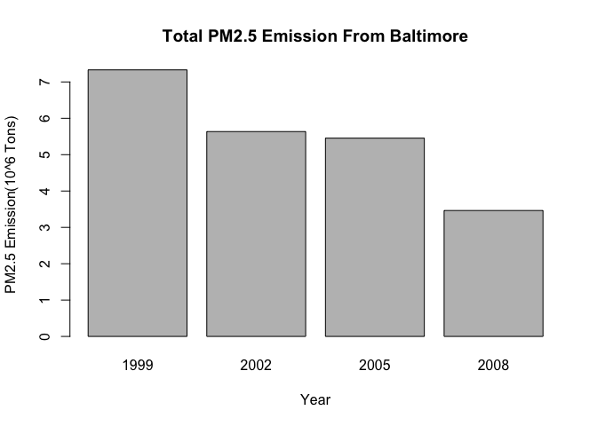
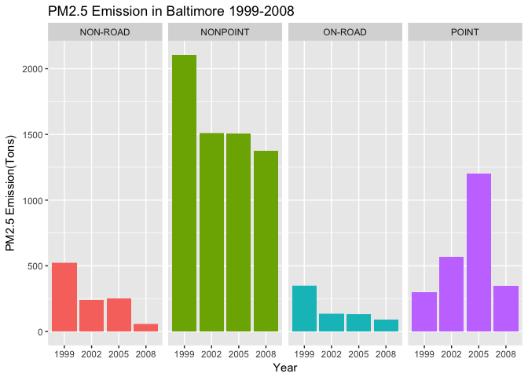
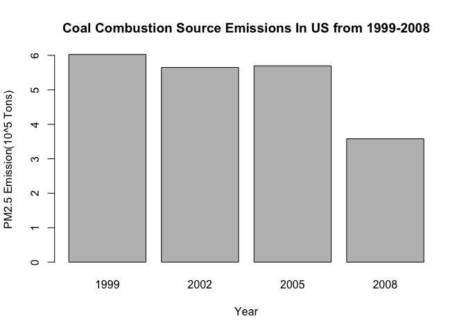
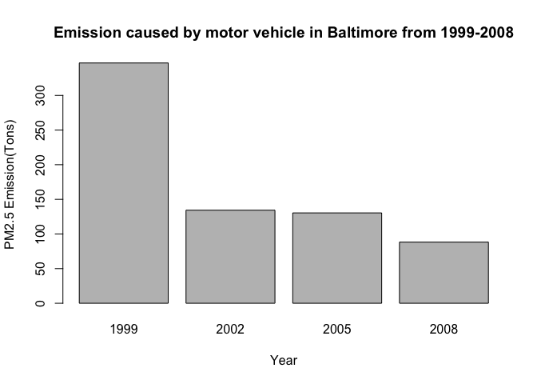
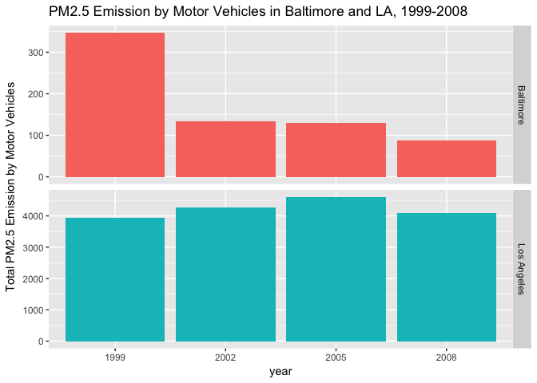

# Exploratory Data Analysis Final Project
Yu Fu  
8/20/2017  


## Introduction

Fine particulate matter (PM2.5) is an ambient air pollutant for which there is strong evidence that it is harmful to human health. In the United States, the Environmental Protection Agency (EPA) is tasked with setting national ambient air quality standards for fine PM and for tracking the emissions of this pollutant into the atmosphere. Approximatly every 3 years, the EPA releases its database on emissions of PM2.5. This database is known as the National Emissions Inventory (NEI). You can read more information about the NEI at the [EPA National Emissions Inventory web site](https://www.epa.gov/air-emissions-inventories).

For each year and for each type of PM source, the NEI records how many tons of PM2.5 were emitted from that source over the course of the entire year. The data that you will use for this assignment are for 1999, 2002, 2005, and 2008.

## Data

The data for this assignment are available from the course web site as a single zip file:

- [Data for Peer Assessment](https://d396qusza40orc.cloudfront.net/exdata%2Fdata%2FNEI_data.zip)[29Mb]

The zip file contains two files:

PM2.5 Emissions Data (𝚜𝚞𝚖𝚖𝚊𝚛𝚢𝚂𝙲𝙲_𝙿𝙼𝟸𝟻.𝚛𝚍𝚜): This file contains a data frame with all of the PM2.5 emissions data for 1999, 2002, 2005, and 2008. For each year, the table contains number of tons of PM2.5 emitted from a specific type of source for the entire year. Here are the first few rows.


```r
##     fips      SCC Pollutant Emissions  type year
## 4  09001 10100401  PM25-PRI    15.714 POINT 1999
## 8  09001 10100404  PM25-PRI   234.178 POINT 1999
## 12 09001 10100501  PM25-PRI     0.128 POINT 1999
## 16 09001 10200401  PM25-PRI     2.036 POINT 1999
## 20 09001 10200504  PM25-PRI     0.388 POINT 1999
## 24 09001 10200602  PM25-PRI     1.490 POINT 1999
```

- 𝚏𝚒𝚙𝚜: A five-digit number (represented as a string) indicating the U.S. county
- 𝚂𝙲𝙲: The name of the source as indicated by a digit string (see source code classification table)
- 𝙿𝚘𝚕𝚕𝚞𝚝𝚊𝚗𝚝: A string indicating the pollutant
- 𝙴𝚖𝚒𝚜𝚜𝚒𝚘𝚗𝚜: Amount of PM2.5 emitted, in tons
- 𝚝𝚢𝚙𝚎: The type of source (point, non-point, on-road, or non-road)
- 𝚢𝚎𝚊𝚛: The year of emissions recorded

Source Classification Code Table (Source_Classification_Code.rds): This table provides a mapping from the SCC digit strings int he Emissions table to the actual name of the PM2.5 source. The sources are categorized in a few different ways from more general to more specific and you may choose to explore whatever categories you think are most useful. For example, source “10100101” is known as “Ext Comb /Electric Gen /Anthracite Coal /Pulverized Coal”.

You can read each of the two files using the readRDS() function in R. For example, reading in each file can be done with the following code:


```r
## This first line will likely take a few seconds. Be patient!
NEI <- readRDS("summarySCC_PM25.rds")
SCC <- readRDS("Source_Classification_Code.rds")
```
as long as each of those files is in your current working directory (check by calling dir() and see if those files are in the listing).

## Data Processing 

The overall goal of this assignment is to explore the National Emissions Inventory database and see what it say about fine particulate matter pollution in the United states over the 10-year period 1999–2008. You may use any R package you want to support your analysis.

Load Package:


```r
library(ggplot2)
```


Loading data:


```r
NEI <- readRDS("summarySCC_PM25.rds")
SCC <- readRDS("Source_Classification_Code.rds")
```

View data:

```r
dim(NEI)
```

```
## [1] 6497651       6
```

```r
dim(SCC)
```

```
## [1] 11717    15
```

```r
head(NEI)
```

```
##     fips      SCC Pollutant Emissions  type year
## 4  09001 10100401  PM25-PRI    15.714 POINT 1999
## 8  09001 10100404  PM25-PRI   234.178 POINT 1999
## 12 09001 10100501  PM25-PRI     0.128 POINT 1999
## 16 09001 10200401  PM25-PRI     2.036 POINT 1999
## 20 09001 10200504  PM25-PRI     0.388 POINT 1999
## 24 09001 10200602  PM25-PRI     1.490 POINT 1999
```

```r
head(SCC)
```

```
##        SCC Data.Category
## 1 10100101         Point
## 2 10100102         Point
## 3 10100201         Point
## 4 10100202         Point
## 5 10100203         Point
## 6 10100204         Point
##                                                                   Short.Name
## 1                   Ext Comb /Electric Gen /Anthracite Coal /Pulverized Coal
## 2 Ext Comb /Electric Gen /Anthracite Coal /Traveling Grate (Overfeed) Stoker
## 3       Ext Comb /Electric Gen /Bituminous Coal /Pulverized Coal: Wet Bottom
## 4       Ext Comb /Electric Gen /Bituminous Coal /Pulverized Coal: Dry Bottom
## 5                   Ext Comb /Electric Gen /Bituminous Coal /Cyclone Furnace
## 6                   Ext Comb /Electric Gen /Bituminous Coal /Spreader Stoker
##                                EI.Sector Option.Group Option.Set
## 1 Fuel Comb - Electric Generation - Coal                        
## 2 Fuel Comb - Electric Generation - Coal                        
## 3 Fuel Comb - Electric Generation - Coal                        
## 4 Fuel Comb - Electric Generation - Coal                        
## 5 Fuel Comb - Electric Generation - Coal                        
## 6 Fuel Comb - Electric Generation - Coal                        
##                 SCC.Level.One       SCC.Level.Two
## 1 External Combustion Boilers Electric Generation
## 2 External Combustion Boilers Electric Generation
## 3 External Combustion Boilers Electric Generation
## 4 External Combustion Boilers Electric Generation
## 5 External Combustion Boilers Electric Generation
## 6 External Combustion Boilers Electric Generation
##                 SCC.Level.Three
## 1               Anthracite Coal
## 2               Anthracite Coal
## 3 Bituminous/Subbituminous Coal
## 4 Bituminous/Subbituminous Coal
## 5 Bituminous/Subbituminous Coal
## 6 Bituminous/Subbituminous Coal
##                                  SCC.Level.Four Map.To Last.Inventory.Year
## 1                               Pulverized Coal     NA                  NA
## 2             Traveling Grate (Overfeed) Stoker     NA                  NA
## 3 Pulverized Coal: Wet Bottom (Bituminous Coal)     NA                  NA
## 4 Pulverized Coal: Dry Bottom (Bituminous Coal)     NA                  NA
## 5             Cyclone Furnace (Bituminous Coal)     NA                  NA
## 6             Spreader Stoker (Bituminous Coal)     NA                  NA
##   Created_Date Revised_Date Usage.Notes
## 1                                      
## 2                                      
## 3                                      
## 4                                      
## 5                                      
## 6
```

Factorize $year

```r
NEI$year <-  as.factor(NEI$year)
```

## Questions

You must address the following questions and tasks in your exploratory analysis. For each question/task you will need to make a single plot. Unless specified, you can use any plotting system in R to make your plot.

1. Have total emissions from PM2.5 decreased in the United States from 1999 to 2008? Using the base plotting system, make a plot showing the total PM2.5 emission from all sources for each of the years 1999, 2002, 2005, and 2008.


```r
emission_total <- aggregate(Emissions ~ year, NEI, sum)
barplot(emission_total$Emissions/10^6,
        names.arg = emission_total$year,
        xlab = "Year",
        ylab = "PM2.5 Emission(10^6 Tons)",
        main = "Total PM2.5 Emission From All US Sources")
```

<!-- -->

Yes, it has decreased.


2. Have total emissions from PM2.5 decreased in the Baltimore City, Maryland (𝚏𝚒𝚙𝚜 == "𝟸𝟺𝟻𝟷𝟶") from 1999 to 2008? Use the base plotting system to make a plot answering this question.


```r
NEI_Baltimore <-  subset(NEI, fips == "24510")
emission_total_Bal <- aggregate(Emissions ~ year, NEI_Baltimore, sum)
barplot(emission_total$Emissions/10^6,
        names.arg = emission_total$year,
        xlab = "Year",
        ylab = "PM2.5 Emission(10^6 Tons)",
        main = "Total PM2.5 Emission From Baltimore")
```

<!-- -->
Yes, it has decreased in Baltimore.

3. Of the four types of sources indicated by the 𝚝𝚢𝚙𝚎 (point, nonpoint, onroad, nonroad) variable, which of these four sources have seen decreases in emissions from 1999–2008 for Baltimore City? Which have seen increases in emissions from 1999–2008? Use the ggplot2 plotting system to make a plot answer this question.


```r
g <- ggplot(aes(x = as.factor(year), y = Emissions, fill = type), data = NEI_Baltimore) + 
        geom_bar(stat = "identity") + 
        facet_grid(.~type)+
        labs(x = "Year", y = "PM2.5 Emission(Tons)" ,
             title = "PM2.5 Emission in Baltimore 1999-2008")+
        guides(fill = F)
g
```

<!-- -->

Non-Road, NonPoint, On-Road have decreased. Point has increased till 2005, then decreased from 2005 to 2008.


4. Across the United States, how have emissions from coal combustion-related sources changed from 1999–2008?


```r
SCC_coal <- SCC[grepl("coal", SCC$Short.Name, ignore.case = T),]
NEI_SCC_coal <- merge(NEI, SCC_coal, by = "SCC")
sum_coal <- aggregate(Emissions ~ year, NEI_SCC_coal, sum)
barplot(sum_coal$Emissions/10^5,
        names.arg = sum_coal$year,
        xlab = "Year",
        ylab = "PM2.5 Emission(10^5 Tons)",
        main = "Coal Combustion Source Emissions In US from 1999-2008")
```

<!-- -->

It has decreased from 1999 to 2008, but increased a little from 2002 to 2005.


5. How have emissions from motor vehicle sources changed from 1999–2008 in Baltimore City?


```r
NEI_Baltimore_vehicle <-  subset(NEI, fips == "24510" & type == "ON-ROAD")
emission_bal_vehicle <- aggregate(Emissions~year, NEI_Baltimore_vehicle,sum)
barplot(emission_bal_vehicle$Emissions,
        names.arg = emission_bal_vehicle$year,
        xlab = "Year",
        ylab = "PM2.5 Emission(Tons)",
        main = "Emission caused by motor vehicle in Baltimore from 1999-2008")
```

<!-- -->

It has decreased a lot.


6. Compare emissions from motor vehicle sources in Baltimore City with emissions from motor vehicle sources in Los Angeles County, California (𝚏𝚒𝚙𝚜 == "𝟶𝟼𝟶𝟹𝟽"). Which city has seen greater changes over time in motor vehicle emissions?


```r
NEI_Baltimore_vehicle <-  subset(NEI, fips == "24510" & type == "ON-ROAD")
NEI_LA_vehicle <-  subset(NEI, fips == "06037" & type == "ON-ROAD")
emission_bal_vehicle <- aggregate(Emissions~year, NEI_Baltimore_vehicle,sum)
emission_LA_vehicle <- aggregate(Emissions~year, NEI_LA_vehicle,sum)
emission_bal_vehicle$county <- "Baltimore"
emission_LA_vehicle$county <- "Los Angeles"
emission_vechile_both <- rbind(emission_bal_vehicle,emission_LA_vehicle)

g <- ggplot(aes(year, Emissions, fill = county),data = emission_vechile_both)
g + geom_bar(stat = "identity")+
        facet_grid(county ~., scales="free")+
        guides(fill = F)+
        labs(x = "year", y = "Total PM2.5 Emission by Motor Vehicles",
             title = "PM2.5 Emission by Motor Vehicles in Baltimore and LA, 1999-2008")
```

<!-- -->

# exploratory-data-analysis_finalProject
